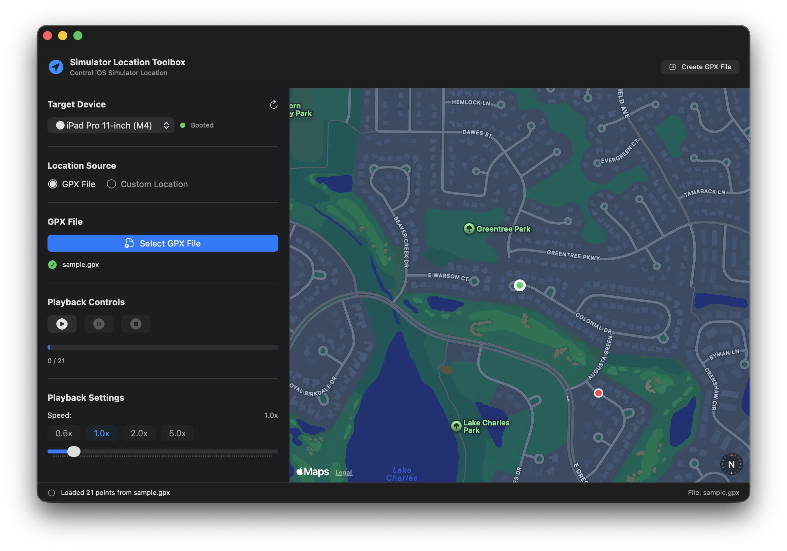
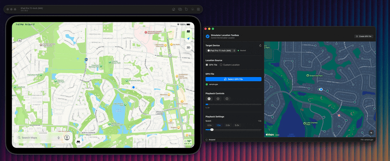
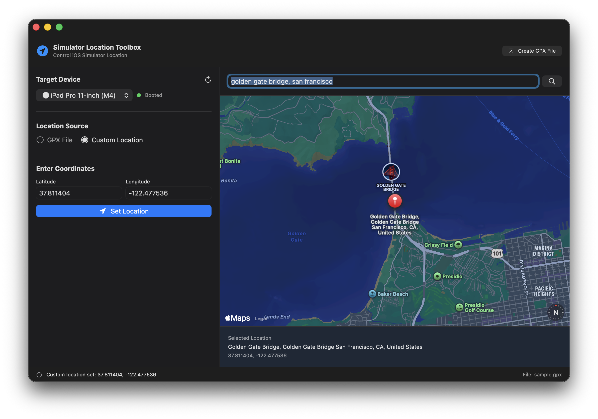
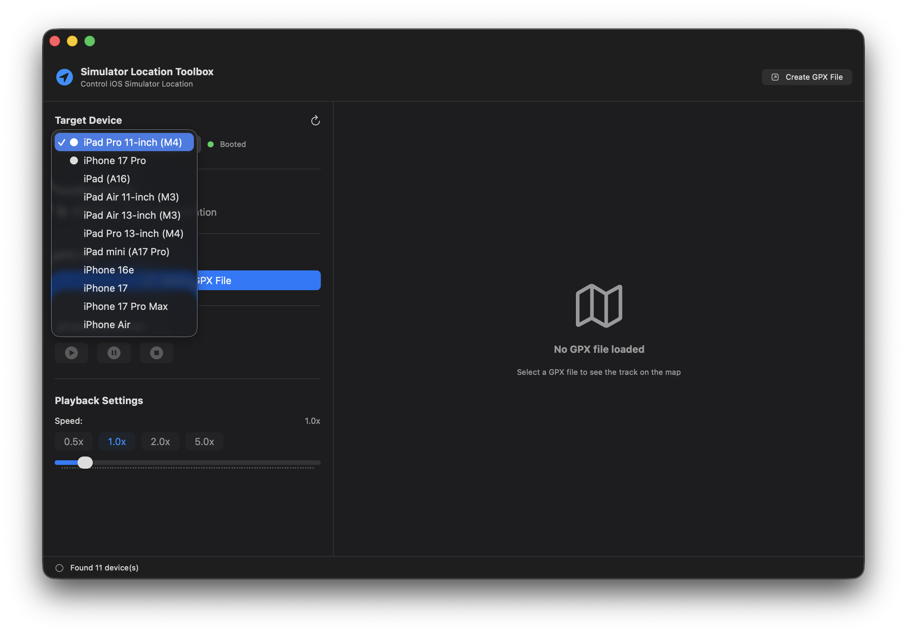

# GPX Simulator Playback

A powerful macOS application for playing back GPX tracks and setting custom locations on iOS Simulators using `xcrun simctl location`.



> Note: This project is not affiliated with or endorsed by Apple Inc., GPX Studio, or any related entities. It is an independent tool developed to enhance iOS Simulator location testing capabilities.

## Features

- 📍 **GPX File Playback**: Load and play GPX files to simulate realistic location tracking

- 🗺️ **Interactive Map Visualization**: 
  - Visualize GPX tracks with color-coded markers (green start, blue current, red end)
  - Interactive map for custom location mode with tap-to-place pin functionality
  - Real-time camera tracking following the current location
- ⚡ **Configurable Playback Speed**: Adjust from 0.1x to 10x with quick presets (0.5x, 1x, 2x, 5x)
- 🎯 **Custom Location Mode**: 
  - Set any location via interactive map (tap to place)
  - Search for locations using Apple's geocoding service
  - Manual coordinate entry with live map updates
  - Reverse geocoding to display addresses

- 📱 **Device Selection**: Choose specific iOS Simulators or use the currently booted device

- 📊 **Progress Tracking**: Real-time progress indicator showing current point and total points
- 🎮 **Full Playback Controls**: Play, pause, stop, and resume with timestamp-based accuracy
- 🔄 **Dual Mode Interface**: Switch between GPX File playback and Custom Location modes via radio buttons

## Requirements

- macOS 14.0 or later
- Xcode 15.0 or later
- At least one iOS Simulator (doesn't need to be booted for custom location mode)

## Installation

### Building from Source

1. Clone the repository and open the project:
   ```bash
   cd SimulatorLocationToolbox
   open SimulatorLocationToolbox.xcodeproj
   ```

2. Build and run the application (⌘+R)

### Running from VS Code

The project includes VS Code debugging support:

1. Open the project folder in VS Code
2. Install the CodeLLDB extension
3. Press F5 or use "Run > Start Debugging" to build and run

## Usage

### GPX File Mode

1. **Select Device**: Choose a specific iOS Simulator from the dropdown or use "Default (Booted)" for the currently running simulator
2. **Load GPX File**: Click "Select GPX File" to choose your GPX track file
3. **View Track**: The map automatically displays the entire track with:
   - 🟢 Green circle: Starting point
   - 🔵 Blue circle: Current playback position
   - 🔴 Red circle: End point
4. **Adjust Speed**: Use preset buttons (0.5x, 1x, 2x, 5x) or drag the slider (0.1x - 10x)
5. **Start Playback**: Click ▶️ to begin location updates
   - Use ⏸️ to pause and resume
   - Use ⏹️ to stop and reset
6. **Monitor Progress**: Watch the real-time progress indicator and point counter

### Custom Location Mode

1. **Switch Mode**: Select the "Custom Location" radio button at the top
2. **Select Device**: Choose your target iOS Simulator
3. **Choose Location** using one of three methods:
   
   **Method 1: Interactive Map (Tap to Place)**
   - Click anywhere on the map to place a pin
   - The coordinates will automatically populate
   - Address will be reverse-geocoded and displayed
   
   **Method 2: Location Search**
   - Type an address or place name in the search bar
   - Press Enter or click the search button
   - Map will center on the location with a pin
   
   **Method 3: Manual Coordinates**
   - Enter latitude and longitude directly in the text fields
   - Map will automatically update to show the location
   - Press Tab or click away to trigger the update

4. **Set Location**: Click "Set Location" to apply to the selected simulator

### Creating GPX Files

Need to create a GPX file? Visit [GPX Studio](https://gpx.studio/app) to create and customize your GPS tracks.

## How It Works

The application uses `xcrun simctl location <device_id> set <latitude>,<longitude>` to send location updates to iOS Simulators. 

**GPX Playback Mode:**
- Parses GPX files to extract track points with coordinates, elevation, and timestamps
- Calculates time intervals between points for realistic playback
- Applies speed multiplier to control playback rate
- Uses async/await for non-blocking, cancellable playback

**Custom Location Mode:**
- Integrates with Apple's CoreLocation for geocoding and reverse geocoding
- Uses MapKit's modern MapReader API for coordinate conversion
- Updates simulator location instantly with a single command

**Device Management:**
- Queries available simulators using `xcrun simctl list devices --json`
- Filters for available devices only
- Supports targeting specific devices or "booted" for the active one

## Creating GPX Files

Need to create a GPX file? Visit **[GPX Studio](https://gpx.studio/app)** to create and customize your GPS tracks with an intuitive map interface.

## GPX File Format

The application supports standard GPX 1.1 format with track segments. Here's the expected structure:

```xml
<?xml version="1.0" encoding="UTF-8"?>
<gpx version="1.1">
  <trk>
    <trkseg>
      <trkpt lat="17.413399" lon="78.460046">
        <ele>585.25</ele>
        <time>2025-10-15T18:30:00.000Z</time>
      </trkpt>
      <!-- More track points... -->
    </trkseg>
  </trk>
</gpx>
```

**Required fields:**
- `lat` and `lon` attributes on `<trkpt>`
- `<time>` element in ISO8601 format (for accurate playback timing)

**Optional fields:**
- `<ele>` for elevation (parsed but not currently used)

## Technical Details

**Architecture:**
- Built with SwiftUI for modern, declarative macOS UI
- MVVM pattern with `@Observable` LocationPlaybackManager
- Dual-mode interface with radio button selection

**Key Technologies:**
- **XMLParser**: Custom GPX file parsing with delegate pattern
- **CoreLocation**: Geocoding, reverse geocoding, coordinate validation
- **MapKit**: Modern Map API with `MapCameraPosition`, `Annotation`, `MapReader`, and `Marker`
- **Process**: Shell command execution for `xcrun simctl`
- **Async/await**: Concurrent playback control with `Task` cancellation
- **Combine**: Reactive state management with `@Published` properties

**UI Components:**
- `ContentView`: Main interface with mode selection and conditional rendering
- `MapView`: GPX track visualization with three-point markers
- `CustomLocationMapView`: Interactive map with tap gestures and search
- `LocationPlaybackManager`: Core business logic and state management
- `GPXParser`: XML parsing to extract `GPXTrackPoint` structs

**Security:**
- App sandbox disabled to allow `xcrun` command execution
- Network client entitlement for geocoding API access

## Troubleshooting

### No location changes in simulator

**For GPX Playback:**
- Ensure an iOS Simulator is booted (or select a specific device)
- Verify the GPX file contains `<time>` elements for proper playback timing
- Check that coordinates are valid (latitude: -90 to 90, longitude: -180 to 180)
- Look for error messages in the app or Console.app

**For Custom Location:**
- Device doesn't need to be booted - location will be set on next launch
- Try using "Default (Booted)" if a specific device isn't working
- Verify coordinates are in the correct format (decimal degrees)

### Map not updating

- If manually entering coordinates, press Tab or click outside the field to trigger the update
- Ensure coordinates are valid numbers
- Try using the search function instead

### Device list is empty

- Click the refresh button (🔄) next to the device dropdown
- Ensure you have Xcode and iOS Simulators installed
- Run `xcrun simctl list devices` in Terminal to verify simulators are available

### Permission errors

- The app requires permission to execute shell commands
- Check that the app sandbox is disabled in the entitlements file
- Verify Xcode Command Line Tools are installed: `xcode-select --install`

### Build errors in VS Code

- Ensure CodeLLDB extension is installed
- Verify Xcode Command Line Tools: `xcode-select -p`
- Clean build folder: Cmd+Shift+K in Xcode or delete `build/` directory

## Project Structure

```
SimulatorLocationToolbox/
├── SimulatorLocationToolbox.xcodeproj/
├── SimulatorLocationToolbox/
│   ├── SimulatorLocationToolboxApp.swift    # App entry point
│   ├── ContentView.swift                 # Main UI with mode selection
│   ├── LocationPlaybackManager.swift     # Core business logic
│   ├── GPXParser.swift                   # GPX file parsing
│   ├── MapView.swift                     # GPX track visualization
│   ├── CustomLocationMapView.swift       # Interactive location picker
│   ├── Assets.xcassets/                  # App icon and resources
│   └── SimulatorLocationToolbox.entitlements # Security settings
├── .vscode/
│   ├── launch.json                       # Debug configuration
│   └── tasks.json                        # Build tasks
└── sample.gpx                            # Example GPX file
```

## Attribution

**App Icon:** [Map pointer icons created by surang - Flaticon](https://www.flaticon.com/free-icons/map-pointer)

## License

MIT License - feel free to use and modify as needed.

## Contributing

Contributions are welcome! Feel free to submit issues or pull requests.

## Feedback

Found a bug or have a feature request? Please open an issue on GitHub!
